# App Dependencies

## Dependency Graph

```mermaid
graph TD
    flow2b_api_contactform --> flow2b_msg
    flow2b_api_contactform --> flow2b_commerce
    flow2b_asset_fixed_rent --> flow2b_asset_fixed
    flow2b_asset_fixed_rent --> flow2b_inv_order
    flow2b_myob --> flow2b_acc
    flow2b_myob --> flow2b_manuf
    flow2b_myob --> flow2b_price
    flow2b_price --> flow2b_product
    tlayen_devmarketplace --> tlayen_devmarketplace_client
    flow2b_trademe --> flow2b_integ_order
    flow2b_trademe --> local_nz
    flow2b_trademe --> flow2b_bank_nz
    tubularequipment_wf --> tubularequipment_common
    flow2b_msg_bulk --> flow2b_msg
    flow2b_msg_bulk --> flow2b_commerce
    flow2b_route --> flow2b_inv_move
    flow2b_trip --> flow2b_organizer
    flow2b_inv_move --> flow2b_inv_stock
    flow2b_payment --> flow2b_acc_finance
    goldsystems_bp --> flow2b_acc_local_nz
    goldsystems_bp --> goldsystems_common
    goldsystems_bp --> flow2b_bank_nz
    goldsystems_bp --> flow2b_integ_fedex
    goldsystems_bp --> flow2b_integ_ups
    goldsystems_bp --> flow2b_manuf
    flow2b_product_var --> flow2b_product
    flow2b_net_hr --> flow2b_organizer
    flow2b_integ_woocommerce --> flow2b_integ_ecom
    flow2b_integ_woocommerce --> flow2b_api_contactform
    tubular_prod --> flow2b_product
    flow2b_inv_order_import --> flow2b_inv_order
    flow2b_inv_order_import --> flow2b_order_parse
    flow2b_marketing --> flow2b_crm_generic
    flow2b_integ_ecom --> flow2b_integ_order
    flow2b_integ_ecom --> flow2b_acc_asset
    flow2b_commerce --> flow2b_location
    flow2b_invoice --> flow2b_payment
    flow2b_invoice --> flow2b_inv_move
    flow2b_invoice --> flow2b_msg
    flow2b_sms --> flow2b_msg
    flow2b_sms --> flow2b_sms_interface
    flow2b_retail --> flow2b_inv_order
    flow2b_integ_fastway --> flow2b_freight_nz
    flow2b_net_crm --> flow2b_crm_generic
    flow2b_net_crm --> flow2b_net_sales
    flow2b_net_crm --> flow2b_trip
    flow2b_net_crm --> flow2b_api_contactform
    flow2b_net_crm --> flow2b_email
    flow2b_bank --> flow2b_payment
    flow2b_crm_generic --> flow2b_inv_order
    flow2b_crm_generic --> flow2b_msg
    flow2b_crm_generic --> flow2b_organizer
    flow2b_acc --> flow2b_acc_asset
    flow2b_acc_local_nz --> flow2b_acc
    flow2b_acc_local_nz --> local_nz
    flow2b_xero --> flow2b_inv_order
    flow2b_xero --> flow2b_integ
    flow2b_xero --> flow2b_acc_asset
    flow2b_xero --> flow2b_asset_fixed_rent
    flow2b_organizer --> flow2b_inv_stock
    goldsystems_jp --> goldsystems_common
    goldsystems_jp --> flow2b_retail
    goldsystems_jp --> flow2b_manuf
    flow2b_net_sales --> flow2b_asset_fixed_rent
    flow2b_net_sales --> flow2b_net_dev
    xmastrees_management --> flow2b_inv_order
    xmastrees_management --> flow2b_exp_timeclock
    xmastrees_management --> flow2b_acc_local_nz
    xmastrees_management --> flow2b_organizer
    xmastrees_management --> flow2b_route
    xmastrees_management --> flow2b_retail
    flow2b_integ_catalog --> flow2b_integ_ecom
    flow2b_net_marketing --> flow2b_net_dev
    flow2b_net_marketing --> flow2b_net_crm
    flow2b_net_marketing --> flow2b_marketing
    flow2b_integ_fedex --> flow2b_freight
    bridesbydonnarae_book --> flow2b_asset_fixed_rent
    bridesbydonnarae_book --> flow2b_organizer
    bridesbydonnarae_book --> bridesbydonnarae_prod
    bridesbydonnarae_book --> flow2b_email
    tubularequipment_common --> flow2b_integ_woocommerce
    flow2b_email --> flow2b_msg
    flow2b_product_clothing --> flow2b_product
    flow2b_product --> flow2b_commerce
    flow2b_product --> flow2b_schedule
    flow2b_product --> flow2b_product_gen
    flow2b_acc_finance --> flow2b_acc_base
    flow2b_acc_finance --> flow2b_product
    flow2b_bank_nz --> flow2b_bank
    flow2b_bank_nz --> flow2b_msg
    flow2b_crm_basic --> flow2b_crm_generic
    local_nz --> flow2b_commerce
    flow2b_payment_link --> flow2b_payment
    goldsystems_catalogue_client --> goldsystems_catalogue
    flow2b_inv_stock --> flow2b_commerce
    flow2b_inv_stock --> flow2b_acc_inv
    goldsystems_catalogue_host --> goldsystems_catalogue
    goldsystems_catalogue_host --> tlayen_ext_issue
    cocobella_import --> flow2b_product_var
    cocobella_import --> flow2b_integ_ecom
    cocobella_import --> flow2b_product_clothing
    tlayen_devmarketplace_client --> tlayen_crossworkspace
    tlayen_devmarketplace_client --> tlayen_ext_issue
    flow2b_acc_base --> flow2b_acc_gen
    flow2b_acc_asset --> flow2b_acc_inv
    flow2b_transferwise --> flow2b_bank
    flow2b_acc_inv --> flow2b_acc_finance
    flow2b_net_dev --> flow2b_net_doc
    flow2b_net_dev --> flow2b_product
    flow2b_net_dev --> flow2b_msg_bulk
    flow2b_net_dev --> flow2b_que
    flow2b_net_dev --> flow2b_api_contactform
    tlayen_workspace_alert --> tlayen_crossworkspace
    flow2b_que --> flow2b_commerce
    goldsystems_common --> flow2b_trademe
    goldsystems_common --> flow2b_integ_woocommerce
    flow2b_integ_order --> flow2b_integ
    flow2b_integ_order --> flow2b_inv_order
    goldsystems_catalogue --> goldsystems_bp
    goldsystems_catalogue --> tlayen_crossworkspace
    bridesbydonnarae_prod --> flow2b_product
    flow2b_integ_facebook_shop --> flow2b_integ_catalog
    flow2b_integ_google_merchant --> flow2b_integ_catalog
    flow2b_freight --> flow2b_location
    flow2b_freight_nz --> flow2b_freight
    abc_runtimeattrs --> flow2b_integ_woocommerce
    flow2b_manuf --> flow2b_inv_move
    flow2b_integ_ups --> flow2b_freight
    goldsystems_jp_import --> goldsystems_jp
    goldsystems_jp_import --> local_nz
    goldsystems_jp_import --> flow2b_bank
    flow2b_location --> flow2b_schedule
    flow2b_asset_fixed --> flow2b_inv_move
    flow2b_asset_fixed --> flow2b_acc_asset
    flow2b_inv_order --> flow2b_invoice
    flow2b_inv_order --> flow2b_price
    flow2b_order_parse --> flow2b_msg
    flow2b_order_parse --> flow2b_commerce
```

## Dependency Details

| App | Version | Dependencies |
|-----|---------|-------------|
| `abc.runtimeattrs` | 1.0.0 | flow2b.integ.woocommerce |
| `benthonlabs.test` | 1.0.0 | None |
| `bridesbydonnarae.book` | 2.23.0 | flow2b.asset.fixed.rent, flow2b.organizer, bridesbydonnarae.prod, flow2b.email |
| `bridesbydonnarae.prod` | 1.2.0 | flow2b.product |
| `cocobella.import` | 1.0.0 | flow2b.product.var, flow2b.integ.ecom, flow2b.product.clothing |
| `core` | 1.1.3 | None |
| `flow2b.acc` | 5.18.0 | flow2b.acc.asset |
| `flow2b.acc.asset` | 5.8.0 | flow2b.acc.inv |
| `flow2b.acc.base` | 5.14.0 | flow2b.acc.gen |
| `flow2b.acc.finance` | 5.53.0 | flow2b.acc.base, flow2b.product |
| `flow2b.acc.gen` | 5.10.0 | None |
| `flow2b.acc.inv` | 5.12.1 | flow2b.acc.finance |
| `flow2b.acc.local.nz` | 5.15.0 | flow2b.acc, local.nz |
| `flow2b.api.contactform` | 1.6.0 | flow2b.msg, flow2b.commerce |
| `flow2b.asset.fixed` | 7.2.0 | flow2b.inv.move, flow2b.acc.asset |
| `flow2b.asset.fixed.rent` | 9.22.0 | flow2b.asset.fixed, flow2b.inv.order |
| `flow2b.bank` | 1.45.3 | flow2b.payment |
| `flow2b.bank.nz` | 1.33.1 | flow2b.bank, flow2b.msg |
| `flow2b.commerce` | 7.17.1 | flow2b.location |
| `flow2b.crm.basic` | 1.5.0 | flow2b.crm.generic |
| `flow2b.crm.generic` | 3.22.0 | flow2b.inv.order, flow2b.msg, flow2b.organizer |
| `flow2b.email` | 6.0.5 | flow2b.msg |
| `flow2b.exp.timeclock` | 1.1.0 | None |
| `flow2b.freight` | 1.4.0 | flow2b.location |
| `flow2b.freight.nz` | 1.0.0 | flow2b.freight |
| `flow2b.integ` | 1.17.1 | None |
| `flow2b.integ.catalog` | 1.5.0 | flow2b.integ.ecom |
| `flow2b.integ.ecom` | 1.42.1 | flow2b.integ.order, flow2b.acc.asset |
| `flow2b.integ.facebook.shop` | 1.2.0 | flow2b.integ.catalog |
| `flow2b.integ.fastway` | 1.1.0 | flow2b.freight.nz |
| `flow2b.integ.fedex` | 1.0.0 | flow2b.freight |
| `flow2b.integ.google.merchant` | 1.5.4 | flow2b.integ.catalog |
| `flow2b.integ.order` | 1.29.1 | flow2b.integ, flow2b.inv.order |
| `flow2b.integ.ups` | 1.0.0 | flow2b.freight |
| `flow2b.integ.woocommerce` | 1.35.0 | flow2b.integ.ecom, flow2b.api.contactform |
| `flow2b.inv.move` | 10.26.3 | flow2b.inv.stock |
| `flow2b.inv.order` | 11.45.2 | flow2b.invoice, flow2b.price |
| `flow2b.inv.order.import` | 5.2.1 | flow2b.inv.order, flow2b.order.parse |
| `flow2b.inv.stock` | 8.14.2 | flow2b.commerce, flow2b.acc.inv |
| `flow2b.invoice` | 16.63.3 | flow2b.payment, flow2b.inv.move, flow2b.msg |
| `flow2b.location` | 2.18.0 | flow2b.schedule |
| `flow2b.manuf` | 2.0.1 | flow2b.inv.move |
| `flow2b.marketing` | 1.3.0 | flow2b.crm.generic |
| `flow2b.msg` | 1.29.0 | None |
| `flow2b.msg.bulk` | 1.2.0 | flow2b.msg, flow2b.commerce |
| `flow2b.myob` | 1.3.0 | flow2b.acc, flow2b.manuf, flow2b.price |
| `flow2b.net.crm` | 3.22.2 | flow2b.crm.generic, flow2b.net.sales, flow2b.trip, flow2b.api.contactform, flow2b.email |
| `flow2b.net.dev` | 11.52.0 | flow2b.net.doc, flow2b.product, flow2b.msg.bulk, flow2b.que, flow2b.api.contactform |
| `flow2b.net.doc` | 1.5.0 | None |
| `flow2b.net.hr` | 1.7.0 | flow2b.organizer |
| `flow2b.net.marketing` | 4.11.2 | flow2b.net.dev, flow2b.net.crm, flow2b.marketing |
| `flow2b.net.sales` | 2.9.1 | flow2b.asset.fixed.rent, flow2b.net.dev |
| `flow2b.nfc` | 1.0.0 | None |
| `flow2b.order.parse` | 5.3.0 | flow2b.msg, flow2b.commerce |
| `flow2b.organizer` | 4.11.1 | flow2b.inv.stock |
| `flow2b.payment` | 12.58.1 | flow2b.acc.finance |
| `flow2b.payment.link` | 12.1.0 | flow2b.payment |
| `flow2b.price` | 7.13.0 | flow2b.product |
| `flow2b.product` | 7.99.0 | flow2b.commerce, flow2b.schedule, flow2b.product.gen |
| `flow2b.product.clothing` | 7.11.0 | flow2b.product |
| `flow2b.product.gen` | 7.7.1 | None |
| `flow2b.product.var` | 7.14.2 | flow2b.product |
| `flow2b.que` | 2.6.0 | flow2b.commerce |
| `flow2b.retail` | 2.9.6 | flow2b.inv.order |
| `flow2b.route` | 2.5.0 | flow2b.inv.move |
| `flow2b.schedule` | 1.7.0 | None |
| `flow2b.sms` | 2.2.0 | flow2b.msg, flow2b.sms.interface |
| `flow2b.sms.interface` | 1.0.1 | None |
| `flow2b.trademe` | 5.39.4 | flow2b.integ.order, local.nz, flow2b.bank.nz |
| `flow2b.transferwise` | 1.2.1 | flow2b.bank |
| `flow2b.trip` | 1.1.0 | flow2b.organizer |
| `flow2b.xero` | 5.26.0 | flow2b.inv.order, flow2b.integ, flow2b.acc.asset, flow2b.asset.fixed.rent |
| `goldsystems.bp` | 6.23.0 | flow2b.acc.local.nz, goldsystems.common, flow2b.bank.nz, flow2b.integ.fedex, flow2b.integ.ups, flow2b.manuf |
| `goldsystems.catalogue` | 1.4.0 | goldsystems.bp, tlayen.crossworkspace |
| `goldsystems.catalogue.client` | 1.2.4 | goldsystems.catalogue |
| `goldsystems.catalogue.host` | 1.1.3 | goldsystems.catalogue, tlayen.ext.issue |
| `goldsystems.common` | 2.8.0 | flow2b.trademe, flow2b.integ.woocommerce |
| `goldsystems.jp` | 3.24.0 | goldsystems.common, flow2b.retail, flow2b.manuf |
| `goldsystems.jp.import` | 1.3.0 | goldsystems.jp, local.nz, flow2b.bank |
| `local.nz` | 1.2.0 | flow2b.commerce |
| `telew.extensions` | 1.0.0 | None |
| `tlayen.crossworkspace` | 1.0.0 | None |
| `tlayen.devmarketplace` | 1.0.2 | tlayen.devmarketplace.client |
| `tlayen.devmarketplace.client` | 1.2.0 | tlayen.crossworkspace, tlayen.ext.issue |
| `tlayen.ext` | 1.0.0 | None |
| `tlayen.ext.issue` | 1.0.0 | None |
| `tlayen.usernetwork` | 1.0.1 | None |
| `tlayen.workspace.alert` | 1.0.2 | tlayen.crossworkspace |
| `tubular.prod` | 1.0.1 | flow2b.product |
| `tubularequipment.common` | 1.0.0 | flow2b.integ.woocommerce |
| `tubularequipment.wf` | 1.0.0 | tubularequipment.common |
| `xmastrees.management` | 2.3.0 | flow2b.inv.order, flow2b.exp.timeclock, flow2b.acc.local.nz, flow2b.organizer, flow2b.route, flow2b.retail |
